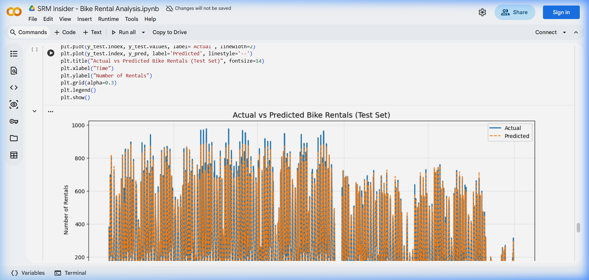
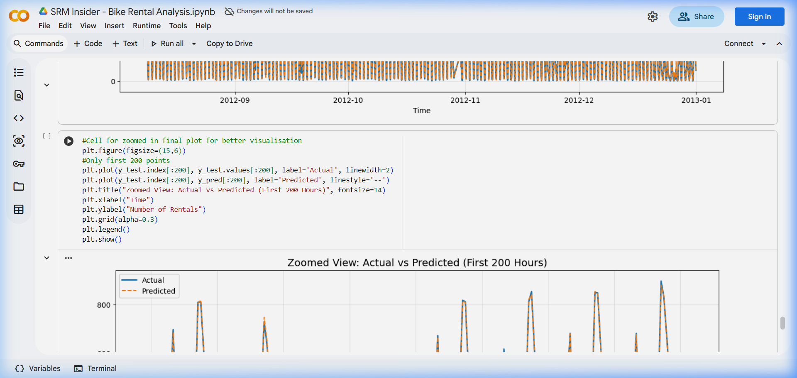

# 04 Model

```python
#Cell for training the model
model = RandomForestRegressor(n_estimators=100, random_state=42)
model.fit(X_train, y_train)
```

```python
#Cell for prediction
y_pred = model.predict(X_test)
```

```python
#Cell for evaluation
mae = mean_absolute_error(y_test, y_pred)
rmse = np.sqrt(mean_squared_error(y_test, y_pred))
print("MAE:", mae)
print("RMSE:", rmse)
```

```python
#Cell to create baseline
baseline_pred = y_test.shift(1).fillna(method='bfill')
baseline_mae = mean_absolute_error(y_test, baseline_pred)
baseline_rmse = np.sqrt(mean_squared_error(y_test, baseline_pred))
print("Baseline MAE:", baseline_mae)
print("Baseline RMSE:", baseline_rmse)
```

```python
#Cell for the final plot
plt.figure(figsize=(15,6))
plt.plot(y_test.index, y_test.values, label='Actual', linewidth=2)
plt.plot(y_test.index, y_pred, label='Predicted', linestyle='--')
plt.title("Actual vs Predicted Bike Rentals (Test Set)", fontsize=14)
plt.xlabel("Time")
plt.ylabel("Number of Rentals")
plt.grid(alpha=0.3)
plt.legend()
plt.show()
```



```python
#Cell for zoomed in final plot for better visualisation
plt.figure(figsize=(15,6))
#Only first 200 points
plt.plot(y_test.index[:200], y_test.values[:200], label='Actual', linewidth=2)
plt.plot(y_test.index[:200], y_pred[:200], label='Predicted', linestyle='--')
plt.title("Zoomed View: Actual vs Predicted (First 200 Hours)", fontsize=14)
plt.xlabel("Time")
plt.ylabel("Number of Rentals")
plt.grid(alpha=0.3)
plt.legend()
plt.show()
```



